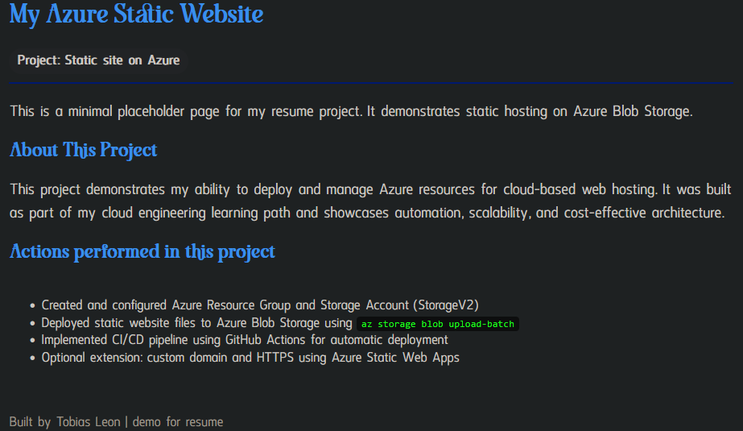

# My Azure Static Website Project

## Overview
I built this static website to practice hosting sites on Azure and automating deployments. It’s a simple site, but it demonstrates how to set up hosting, deploy updates automatically, and use custom fonts for design.

## Screenshot

## What I Did
- Created a responsive website using HTML and CSS  
- Added **Shigat** for headings and **Anticyclone** for body text  
- Made a 404 page for broken links  
- Managed the project in **GitHub** with version control  
- Set up **Azure Storage** for static website hosting  
- Used **GitHub Actions** to automatically deploy changes  
- Checked the site to make sure everything works online  

## Tools & Skills
- Azure Blob Storage – Hosting the website  
- GitHub & GitHub Actions – Source control and CI/CD  
- HTML & CSS – Frontend design  
- Custom fonts – `.ttf` files for headings and body  
- Azure CLI – Managing and uploading files  
- Service Principal & GitHub Secrets – Secure deployment  

## Live Site
[View the site here](https://mystaticsite01.z13.web.core.windows.net/)

## Skills Highlighted
- Deploying and hosting websites on Azure  
- Automating deployments with GitHub Actions  
- Responsive web design  
- GitHub project management and documentation  
